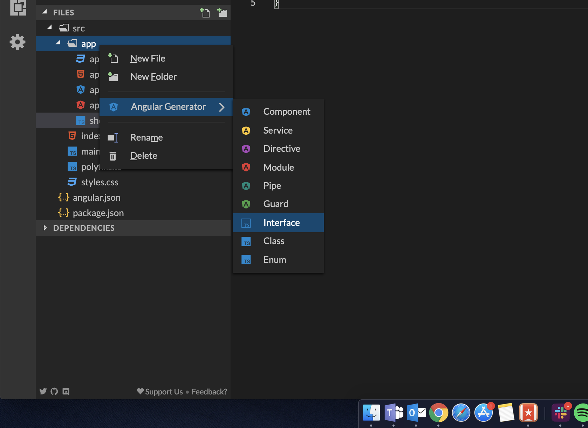

# Cómo almacenar información en nuestra base de datos

En la lección anterior, conectamos nuestra aplicación a Firebase. Ahora es el momento de comenzar a escribir contenido en la base de datos, para eso necesitamos un par de cosas:

- Un formulario que nos permite escribir el contenido.
- Una función que toma ese contenido y lo envía a Firestore.
- Una forma de conocer el contenido se guardó con éxito.

Con esto en mente, comencemos con el número 1, queremos crear un botón que al hacer clic genere una nueva tarjeta TVShow por nosotros y almacene la información dentro de la **Base de datos Firestore**.

Para eso lo primero que haremos es crear el botón en nuestro archivo `app.componente.html`; adelante, elimina todo de ese archivo y haz que se vea así:

```html
<header>
  <h1>TV SERIES!</h1>
  <p>📺 Your favorite TV Shows 📺</p>
</header>

<div class="add">
  <button (click)="add()">ADD</button>
</div>
```

Estamos agregando un título de página y un botón; cuando se hace clic en él, el botón llamará a la función `add()` dentro de nuestro `app.component.ts`. Probablemente esté pensando, "_pero no tengo una función add()_", lo sabemos, por eso la vamos a crear de inmediato.

Primero, haremos un poco de limpieza, TypeScript es excelente porque nos permite definir types para nuestros objetos, de esa manera obtenemos una mejor integración del editor con autocompletado o detectamos errores de sintaxis en el lugar!

Queremos crear un type para nuestros programas de televisión, de esa manera cada parte de nuestra aplicación sabe exactamente cómo se ve un programa de televisión. Para crear ese type usaremos el **Angular Generator**, haz clic con el botón derecho en en la carpeta `app/`, ve a **Angular Generator** y haz clic en **Interface** como se muestra en la siguiente imagen.



Nombra a tu interfaz `show`.

Una vez hecho esto, agreguemos las propiedades que queremos dentro de la interfaz, un programa debe tener una ID, un nombre y una imagen, así que abre `show.interface.ts` y haz que se vea así:

```js
export interface Show {
  id: string;
  name: string;
  picture: string;
}
```

Ahora podemos ir a nuestro archivo `app.component.ts` y comenzar a crear la funcionalidad de nuestras aplicaciones.

Lo primero que debemos hacer es importar todo lo que necesitamos dentro del archivo:

```js
import { Component } from '@angular/core';
import { Observable } from 'rxjs';
import { Show } from './show.interface';
import { AngularFirestore, AngularFirestoreCollection } from '@angular/fire/firestore';
```

Estamos importando:

- `Observable` porque los servicios de Firebase devuelven Observables y queremos usar los types correctos.
- `Show` porque nuestros Observables van a ser del tipo `Show` (_recuerden la Interfaz que acabamos de crear_).
- `AngularFirestore` para poder interactuar con nuestra base de datos Firestore.
- `AngularFirestoreCollection` porque ese es el tipo de colecciones que usa Firestore.

Después de eso, crearemos 2 propiedades de clase, justo antes de nuestro `constructor()`:

```js
showCollection: AngularFirestoreCollection<Show>;
showList: Observable<Show[]>;
```

Estamos creando:

- `showCollection` como referencia a la colección Firestore donde se almacenarán nuestros datos.
- `showList` Esta es la lista que contendrá todos nuestros programas y nos permite mostrarlos en la página.

Entonces necesitamos inicializar todo dentro de nuestro `constructor()`:

```js
constructor(private db: AngularFirestore) {
  this.showCollection = db.collection('shows');
  this.showList = this.showCollection.valueChanges();
}
```

Lo que está haciendo `this.showCollection = db.collection ('shows');` es crear una referencia a una colección Firestore llamada 'shows', piensa en esto como en crear una ruta directa al lugar donde almacenaremos nuestros programas de TV.

Y luego `this.showList = this.showCollection.valueChanges();` toma esa referencia y la transforma en un `Observable` que es una lista que luego podemos mostrar en la página.

Después de eso, es hora de crear la función `add()` real, recuerda, nuestro `TVShow` tiene 3 propiedades, una ID, un nombre y una imagen, por lo que debemos enviar esas 3 propiedades a Firestore.

Vamos, agrega esto después de nuestro `constructor()`:

```js
add() {
  const id = this.db.createId();
  const picture = this.getRandomPicture();
  const name = '';
  this.showCollection
    .doc(id)
    .set({ name, picture, id });
}

getRandomPicture() {
  const randomNumber = Math.round(Math.random() * 20);
  return 'https://picsum.photos/100/100?image=' + randomNumber;
}
```

Aquí está lo que está pasando, primero, la función `getRandomPicture()` toma la URL o una página para crear imágenes aleatorias y comienza a pasarle números aleatorios para generar enlaces aleatorios, esto devuelve una URL que podemos pasar a cualquier tag `</img>` y renderizar en la página.

Entonces, analicemos la función `add()` línea por línea:

- Primero, estamos usando `const id = this.db.createId()` para crear una nueva ID aleatoria para nuestro programa, luego asignamos esa ID a la variable `id`.
- Segundo, estamos usando `const picture = this.getRandomPicture()` para crear un enlace de imagen y asignarlo a la variable `picture`.
- Estamos configurando la variable de nombre a una cadena vacía con `const name = ''`.
- Luego vamos a nuestra referencia `showCollection` y con `.doc (id)` estamos diciendo, "_hey, de esa lista de programas entra en este show específico_".
- Y por último, estamos usando `.set({name, picture, id})` para establecer las propiedades dentro del objeto.

## Siguientes pasos

En este momento, tu aplicación puede hablar con Firebase, sigue adelante, jugar con ella, revisa si todo se ve bien y luego preparate para pasar a la siguiente sección donde mostraremos todas las tarjetas que estás creando en la página :)
