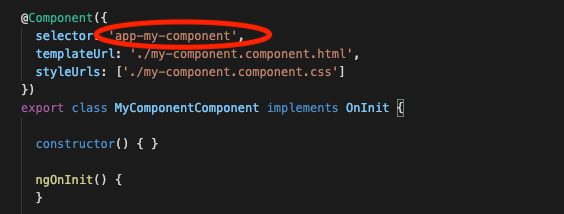

# Brownie Points

En primer lugar, felicitaciones, estamos muy contentos de que hayas terminado el taller y todos esperamos que hayas aprendido mucho :-)

Si está dispuest@ a hacerlo, hay un cambio que queremos que hagas a la aplicación, y se trata de hacerlo modular, más fácil de mantener utilizando componentes de Angular.

Un componente es un bloque básico en una aplicación Angular. Puedes extraer funcionalidad en un componente y luego reutilizarlo en toda su aplicación.

Por ejemplo, supongamos que tienes una lista de elementos dentro de tu aplicación, pero luego te das cuenta de que necesitas esa lista en otro lugar, ¿copiarías / pegarías la lista en el nuevo lugar? ¿Dejándote con dos (o más) listas para mantener?

Lo que deberíamos hacer allí es crear la lista como un componente, y luego usar ese componente en todos los lugares en que necesitamos la lista, de esa manera mantendremos una sola lista y la usaremos en cualquier lugar que queramos.

Para crear un componente, usarás el **Angular Generator** dentro de Stackblitz, de la misma forma que creaste la interfaz, pero haciendo clic en **Component**.


Una vez que se crea el componente, obtienes una nueva carpeta con varios archivos, un HTML, un CSS y un archivo TS, para manejar la vista, los estilos y la lógica de ese componente.

Moverás la lógica de la funcionalidad a ese componente, y luego podrás usarla en cualquier lugar dentro de tu aplicación, para usarla querrás encontrar el selector de componentes.

Dentro de los componentes, busca en el archivo TypeScript el decorador `@Component()`, el selector está allí:



Todo lo que necesitas hacer es llamar al selector dentro de tu aplicación:

```html
<header>
  <h1>TV SERIES!</h1>
  <p>📺 Your favorite TV Shows 📺</p>
</header>

<div class="add">
  <button (click)="add()">ADD</button>
</div>

<tv-show-card></tv-show-card>
```

Ahora intentalo tu mism@, sige adelante y transforma nuestra tarjeta en un componente y luego procésala en la pantalla.

Recuerda, no seas tímid@ ni tengas miedo de hacer preguntas, ¡los mentores están aquí para ayudarte!
